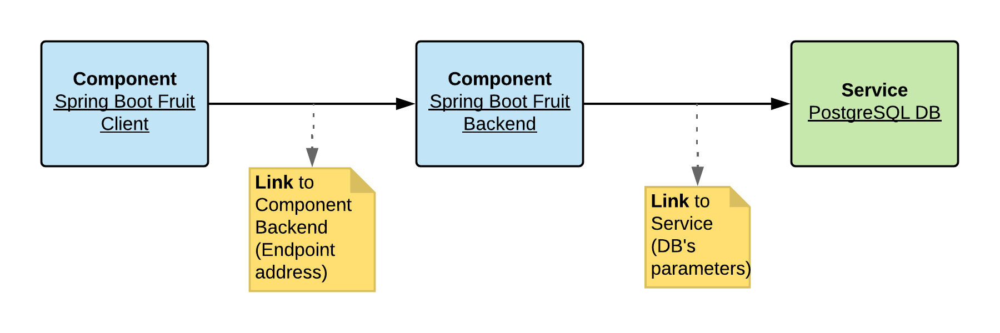

# Spring Boot Demo

  * [Introduction](#introduction)
  * [Setup](#setup)
     * [Hetzner remote's cluster](#hetzner-remotes-cluster)
     * [Local cluster using MiniShift](#local-cluster-using-minishift)
  * [Demo's time](#demos-time)
     * [Install the project](#install-the-project)
     * [Build code](#build-code)
     * [Install the components](#install-the-components)
     * [Create the database's service usign the Catalog](#create-the-databases-service-usign-the-catalog)
     * [Link the components](#link-the-components)
     * [Push the code and start the Spring Boot application](#push-the-code-and-start-the-spring-boot-application)
     * [Check if the Component Client is replying](#check-if-the-component-client-is-replying)
  * [Cleanup](#cleanup)
     * [Demo components](#demo-components)
     * [Operator and CRD resources](#operator-and-crd-resources)


## Introduction

TODO : Add introduction like also a picture showing what the composite application will looks like



## Setup

### Hetzner remote's cluster
```bash
oc login https://195.201.87.126:8443 --token=TOKEN_PROVIDED_BY_SNOWDROP_TEAM
oc project <user_project>
```

### Local cluster using MiniShift

- Minishift (>= v1.26.1) with Service Catalog feature enabled
- Launch Minishift VM

```bash
# if you don't have a minishift VM, start as follows
minishift addons enable xpaas
minishift addons enable admin-user
minishift start
minishift openshift component add service-catalog
minishift openshift component add automation-service-broker
```

- Add `Cluster Admin` role to the admin user
```bash
oc login -u system:admin
oc adm policy add-cluster-role-to-user cluster-admin admin
oc login -u admin -p admin
```

- Deploy the resources within the namespace `component-operator`

```bash
oc new-project component-operator
oc create -f resources/sa.yaml
oc create -f resources/cluster-rbac.yaml
oc create -f resources/crd.yaml
oc create -f resources/operator.yaml
```

## Demo's time

### Install the project

- Git clone the project locally to play with a Spring Boot composite application
```bash
git clone https://github.com/snowdrop/component-operator-demo.git && cd component-operator-demo
```

- Create a new project `my-spring-app`
```bash
oc new-project my-spring-app
```

### Build code

- Build the `Client` and the `Backend` using `mvn tool` to generate their respective  Spring Boot uber jar file
```bash
cd fruit-client
mvn package
cd ..
cd fruit-backend
mvn package
cd ..
``` 

### Install the components

- Deploy for each microservice, their Component CRs on the cluster and wait till they will be processed by the controller 
  to create the corresponding kubernetes resources such as DeploymentConfig, Pod, Service, Route, ...
```bash
oc apply -f fruit-backend/component.yml
oc apply -f fruit-client/component.yml
```  

- Verify that we have 2 components installed
```bash
oc get cpoc get cp
NAME            RUNTIME       VERSION   SERVICE   TYPE      CONSUMED BY   AGE
fruit-backend   spring-boot   1.5.16                                      34s
fruit-client    spring-boot   1.5.16                                      32s
```

### Create the database's service usign the Catalog

- Create the `PostgreSQL database` using the `db-service.yml` Component CR
```bash
oc apply -f fruit-backend/db-service.yml
```

**WARNING** As this process is performed asynchrounously and is managed by the Kubernetes Service Catalog controller in combination with the Service Broker, then this process can take time !

**Remark** Use the following command to check the status of the instance which, at the end of the installation process, should be equal to `ready`
```bash
oc get serviceinstance/postgresql-db
NAME            CLASS                                   PLAN      STATUS    AGE
postgresql-db   ClusterServiceClass/dh-postgresql-apb   dev       Ready     3m
```

- Control as we did before that we have 3 components installed: 2 Spring Boot runtimes and 1 service
```bash
oc get cp
NAME             RUNTIME       VERSION   SERVICE         TYPE      CONSUMED BY   AGE
fruit-backend    spring-boot   1.5.16                                            2m
fruit-client     spring-boot   1.5.16                                            2m
fruit-database                           postgresql-db                           6s
```

### Link the components

- Inject as ENV variables the parameters of the database to let Spring Boot to create a Datasource's bean to connect to the database using the
  secret created 
```bash
oc apply -f fruit-backend/link-secret-service.yml
```  

- Inject the endpoint's address of the `fruit backend` application as an ENV Var. This ENV Var will be used as parameter by the Spring Boot application
  to configure the HTTP client to access the backend
```bash
oc apply -f fruit-client/link-env-backend.yml
``` 

### Push the code and start the Spring Boot application

- As we have finished to compose our application `from Spring Boot Http Client` -> to `Spring Boot REST Backend` -> to `PostgreSQL` database, we will 
  now copy the uber jar files, and next start the `client`, `backend` Spring Boot applications. Execute the following commands : 
```bash
./push_start.sh fruit-client
./push_start.sh fruit-backend
```   

### Check if the Component Client is replying

- Call the HTTP Endpoint exposed by the `Spring Boot Fruit Client` in order to fetch data from the database
```bash
route_address=$(oc get route/fruit-client -o jsonpath='{.spec.host}' )
curl http://$route_address/api/client
or 

using httpie client
http http://$route_address/api/client
http http://$route_address/api/client/1
http http://$route_address/api/client/2
http http://$route_address/api/client/3
``` 

## Cleanup

### Demo components

```bash
oc delete cp/fruit-backend
oc delete cp/fruit-database
oc delete cp/fruit-database-config

oc delete cp/fruit-client
oc delete cp/fruit-endpoint
```

### Operator and CRD resources

```bash
oc delete -f resources/sa.yaml -n component-operator
oc delete -f resources/cluster-rbac.yaml
oc delete -f resources/crd.yaml 
oc delete -f resources/operator.yaml -n component-operator
```
  
